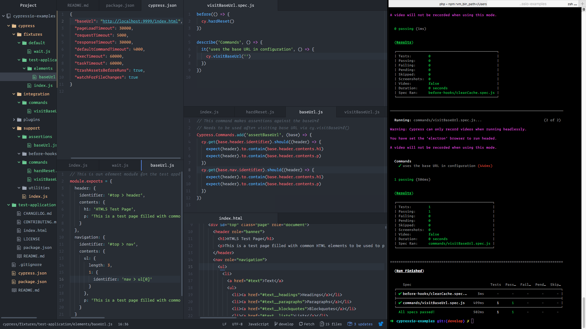

# Bash LSD

To remember a loved one, we at [WithPulp](http://withpulp.com) thought it best to share the bash profile and preferences of Isam Machlovi. Founder and genius behind a lot of what WithPulp is and does.

This is a collection of command shortcuts, such as `gs` for `git status`, [see more](./wiki/Shortcuts.md).

Some of us use the `robbyrussell` theme for [zsh](https://ohmyz.sh/). Isam customized his terminal to use the [operator](https://www.typography.com/blog/introducing-operator) font. Enjoy!

#### [Wiki](./wiki)

* [Getting Stared](wiki/Getting-Started.md)
* [Shortcuts](wiki/Shortcuts.md)
